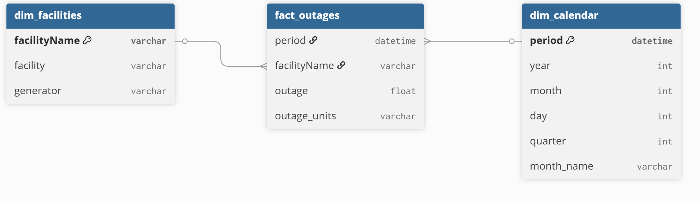

# Software Engineer - Technical Challenge Arkham 

## Description
Data pipeline that extracts Nuclear Outages data from the EIA API, stores it efficiently, 
and provides basic analytics and query capabilities.

The datat flow is thto following one:

`EIA API → Python Connector → Delta Table → Parquet → DuckDB → FastAPI → Streamlit`

## Quick start
**How to clone and start**

**1.- Clone the repo**

**2.- Configure .env file**

This file must have EIA_API_KEY=key and a APP_AUTH_KEY=Key

&emsp; for example:

&emsp; EIA_API_KEY=API_Key

&emsp; APP_AUTH_KEY=KeyAuth123

**3.-Install dependencies**

```bash
mkdir nuclear-outages-challenge
cd nuclear-outages-challenge
python -m venv venv
Activate on Windows: venv\Scripts\activate | En Mac/Linux: source venv/bin/activate
pip install -r requirements.txt
```

**4.- Start backend**

&emsp; Run Service File: *src/api.py*

&emsp; Command:
    ```python -m src.api```

**5.- Start frontend**

&emsp; Run Service File: *src/app_frontend.py*

&emsp; Command:
    ```streamlit run frontend/app_frontend.py ``` 

## Implementation (Bonus)

* **Delta Lake Integration:** ACID transactions for raw data storage.

* **Incremental Extraction:** Logic to only fetch new data since the last update.

* **High-Speed Queries:** DuckDB engine for sub-second filtering of 700k+ rows.

* **Security:** API Key authentication for write operations (/refresh).

* **Automated Tests:** 5 test cases covering critical pipeline parts.

* **Cloud deployment:** URL of the website.

## Assumtions made

* **Granularidad:** The assumtion of data frequecy is daily because it is a standard for reports.
* **Timezone:** Time periods are standard EIA strings (YYYY-MM-DD) in order to maintain source integrity.
* **Null handle:** Logs where outage field is null or invalid it is assumed that the value is 0.
* **Cloud deployent:** Due to the render plan is free, the user must reload all the data in order to test the application.

## Data Model

Table dim_facilities {

&emsp; facilityName varchar [primary key]

&emsp; facility varchar

&emsp; generator varchar

}

Table dim_calendar {

&emsp; period datetime [primary key]

&emsp; year int

&emsp; month int

&emsp; day int

&emsp; quarter int

&emsp; month_name varchar

}

Table fact_outages {

&emsp;period datetime

&emsp; facilityName varchar

&emsp; outage float

&emsp; outage_units varchar

}

*fact_outages* This table is the core of the model because it store interruption metrics linked to a factory and a date.

*Ref: fact_outages.facilityName > dim_facilities.facilityName* Factories in `dim_facilities` could have multiple interruption logs in `fact_outages` over time.

*Ref: fact_outages.period > dim_calendar.period* Every date log in `dim_calendar` is linked to every interruption event ocurred in that specific period of time.



## Technologies

* FastAPI
* Pandas + PyArrow
* Streamlit frontend
* Parquet, DuckDB
* python-dotenv

## API Reference

**Enpoints guide:**

* *GET /data:* Returns filtered and paged data.
 
* *POST /refresh:* Triggers the extraction pipeline (ETL) in the background. Downloads new data from EIA, update Delta tables.

## Result examples

Visualization of the top 10 facotries with more impact to the electrical network (MW) and detailed table by name reactor.

**Unit test and integration**

Automated test where implemented in order to validate the pipeline.

&emsp; Command to run the tests: 
```python -m pytest```

```bash
======== test session starts ======== 
platform win32 -- Python 3.13.0, pytest-9.0.2, pluggy-1.6.0
rootdir: C:\Users\sergi\OneDrive\Escritorio\Reto Arkham
plugins: anyio-4.12.1, requests-mock-1.12.1
collected 5 items                                                                                                                                                                     
tests\test_api.py ...                                                                            [ 60%] 
tests\test_connector.py ..                                                                       [100%] 

========  5 passed in 1.48s ======== 
```